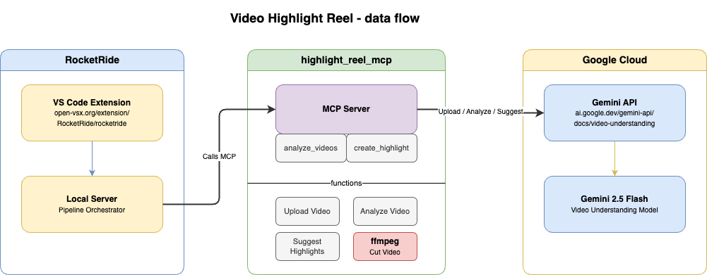
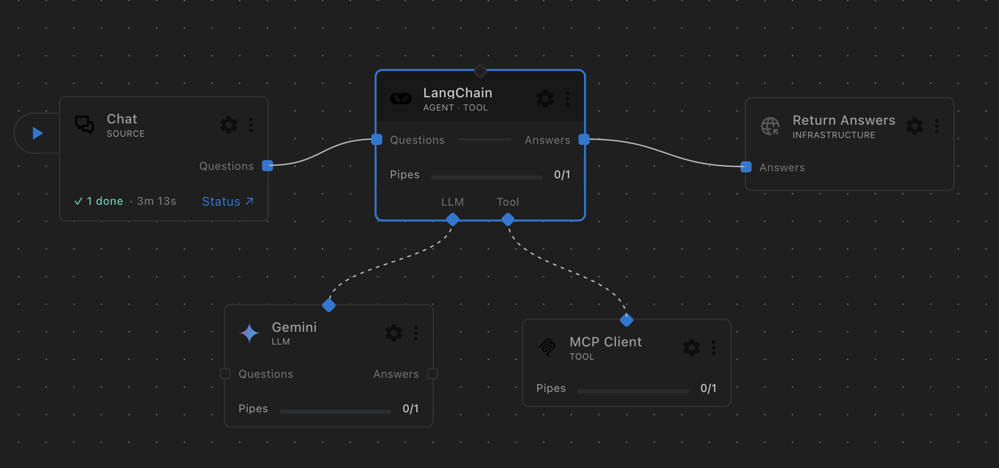
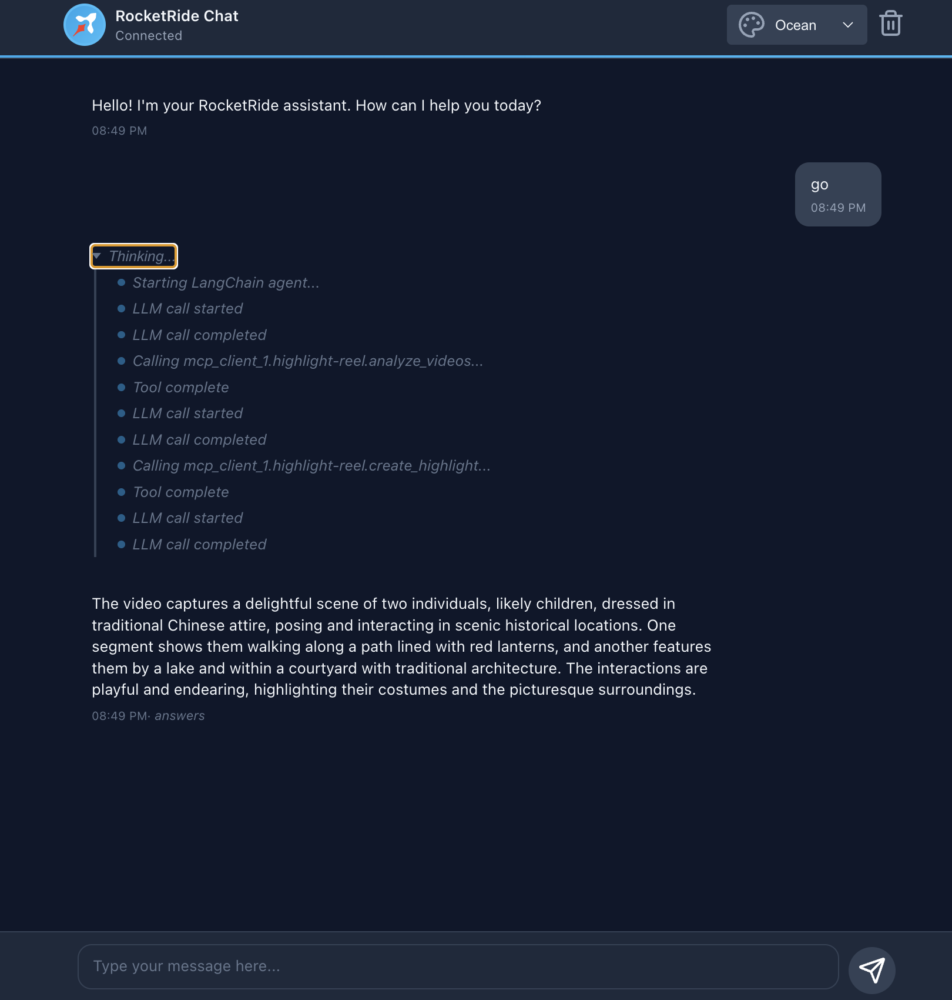
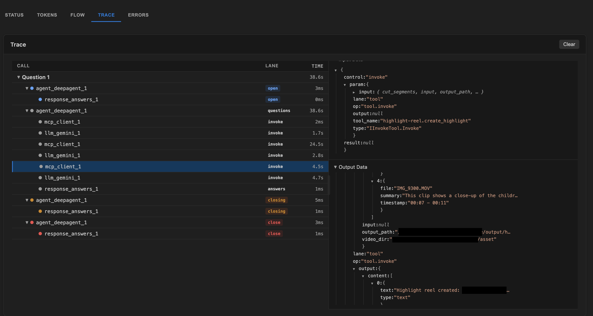

# Video Highlight Reel Generator

**Hackathon Project — Google Developer Groups Newport Beach x RocketRide**

Automatically generate highlight reels from video clips using AI-powered analysis. Type a message, and the pipeline uploads your videos to Gemini, identifies the best segments, and cuts them into a polished highlight reel using ffmpeg.

## Architecture



The system has three main components:

### RocketRide

- [VS Code Extension](https://open-vsx.org/extension/RocketRide/rocketride) — visual pipeline builder and chat interface
- Local Server — pipeline orchestrator that coordinates the agent, LLM, and MCP tool calls

### highlight_reel_mcp (MCP Server)

A custom MCP server called by the RocketRide pipeline. It exposes two tools:

- **analyze_videos** — uploads video files to Google Gemini, analyzes content, and returns recommended highlight segments with timestamps
- **create_highlight** — uses ffmpeg to extract and concatenate the selected segments into a final highlight reel

### Google Gemini API

- [Gemini API — Video Understanding](https://ai.google.dev/gemini-api/docs/video-understanding) — uploads and analyzes video content
- **Gemini 2.5 Flash** — identifies key moments across multiple video files and suggests cut segments targeting ~30 seconds of highlights

## Pipeline



The RocketRide pipeline wires together:
1. **Chat** (source) — user triggers the workflow
2. **LangChain Agent** — orchestrates the tool calls and generates the final summary
3. **Gemini LLM** — powers the agent's reasoning
4. **MCP Client** — connects to the highlight_reel_mcp server for video analysis and cutting

## Demo

### Chat Interface



### Execution Trace



## Setup

1. Install the [RocketRide extension](https://open-vsx.org/extension/RocketRide/rocketride) in VS Code
2. Copy `.env.example` to `.env` and add your Gemini API key:
   ```
   GEMINI_API_KEY=your-key-here
   ```
3. Place video files in an `asset/` directory
4. Open `video-highlight.pipe` in the RocketRide extension and run the pipeline

## Requirements

- [ffmpeg](https://ffmpeg.org/) installed and on PATH
- [uv](https://docs.astral.sh/uv/) for Python package management
- A Google Gemini API key
